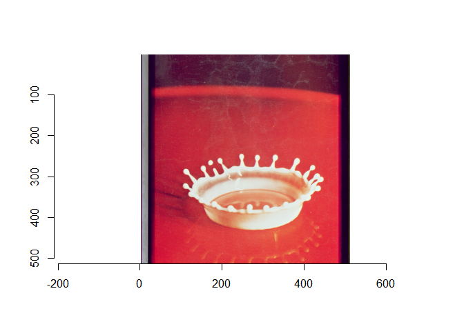
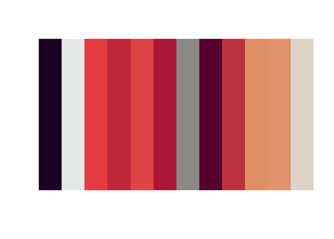
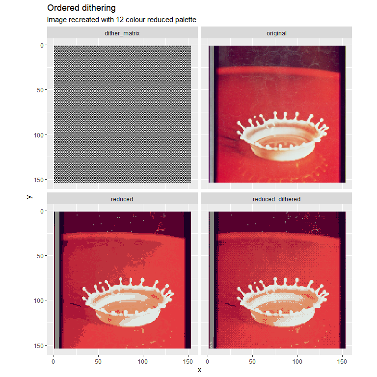

<!-- README.md is generated from README.Rmd. Please edit that file -->

# Image dithering

I’ve recently taken an interest in image dithering and retro-style
computer grame graphics. This started when I tried to simulate the
original Game Boy DMG-01 graphics with the [R package
ggboy](https://github.com/cj-holmes/ggboy).

Applying image dithering in greyscales was fairly simple, but I wanted
to also understand how to apply it to colour images.

This repository is a record of what I learnt. It might not be
technically correct from a ‘purists’ point of view, but it gives the
desired effect that I was looking for.

``` r
library(tidyverse)
library(imager)
```

## Import image

Read in image and visualise

``` r
img <- 'lenna.png'
i <- imager::load.image(img)
plot(i)
```

<!-- -->

## Reduce image size

Reduce the image size to make things run a bit faster

``` r
# Create image2 which is 30% of the size of the original
i2 <- i %>% imager::resize(size_x = -30, size_y = -30)
# Save a local copy of the reduced image
imager::save.image(i2, "reduced_image.png")
```

Convert from the `imager` `cimg` object to a dataframe for tidy style
processing. This includes converting the dataframe to wide format with a
separate column for the R, G and B channels.

``` r
i2_df <-
  as.data.frame(i2) %>% 
  spread(k=cc, v=value) %>% 
  mutate(x = x, 
         y = y, 
         original = pmap_chr(list(`1`, `2`, `3`), ~rgb(..1, ..2, ..3))) %>% 
  rename(r = `1`, g = `2`, b = `3`)
```

## Extract a smaller ‘target’ palette from the reduced image

I need a smaller ‘target’ colour palette to make the dithered image from

``` r
# Number of colours wanted in smaller target palette
target_palette_size <- 12

set.seed(5)
reduced_palette <-
  colorfindr::get_colors('reduced_image.png') %>% 
  colorfindr::make_palette(target_palette_size)
#> Warning: Quick-TRANSfer stage steps exceeded maximum (= 1170450)
```

<!-- -->

Extract RGB coordinates of the each colour in the reduced palette and
scale them to 0-1 (by dividing by 255)

``` r
reduced_palette_rgb <- lapply(reduced_palette, function(x) col2rgb(x)/255 %>% as.vector())

# Create vectors of the indivdual R, G and B values for use later
rp_r <- sapply(reduced_palette_rgb, function(x) x[1])
rp_g <- sapply(reduced_palette_rgb, function(x) x[2])
rp_b <- sapply(reduced_palette_rgb, function(x) x[3])
```

## Bayer matrix

Most of this code and method comes from

  - [Wikipedia article on ordered
    dithering](https://en.wikipedia.org/wiki/Ordered_dithering)
  - [Rasmus Bååth’s Research
    Blog](http://www.sumsar.net/blog/2019/01/image-dithering-in-r/)
  - [Stack overflow
    question](https://stackoverflow.com/questions/54372456/is-this-a-correct-implementation-of-ordered-dithering)

What I am doing might not be exactly right from a ‘purist’ point of
view, but it seems to give the effect I am looking for in this
application - based purely on visual aesthetics.

#### Functions

``` r
# Create a square Bayer matrix
bayer <- function(n){

  if(n <= 0) return(matrix(0))

  m <- bayer(n-1)

  rbind(
    cbind(4 * m + 0, 4 * m + 2),
    cbind(4 * m + 3, 4 * m + 1))
}

# Normalise a Bayer matrix
norm_bayer <- function(m) m/length(m)

# Repeat a Bayer matrix to fill a required 2 dimensional space
rep_mat <- function(mat, nrow_out, ncol_out) {
  mat[
    rep(seq_len(nrow(mat)), length.out = nrow_out),
    rep(seq_len(ncol(mat)), length.out = ncol_out)
    ]
}
```

#### Create dithering matrix

Create the dither matrix and append it to the dataframe

``` r
bayer_size <- 3

dither_mat <- 
  bayer(bayer_size) %>%
  norm_bayer() %>% 
  rep_mat(nrow_out = imager::height(i2),
          ncol_out = imager::width(i2))

# Append matrix to dataframe and subtract 0.5 from normalised matrix
i2_df <-
  i2_df %>% 
  mutate(dither_mat = as.vector(dither_mat)-0.5)
```

## Non-dithered

Create a reduced palette image that is not dithered and append it to the
dataframe

``` r
# A convenience function that takes the current 'actual' RGB values and returns the closest colour from the target palette
closest_colour <- function(r,g,b){

   t <- sqrt((r - rp_r)^2 + (g - rp_g)^2 + (b - rp_b)^2)
   
   reduced_palette[t == min(t)][[1]]
}

# Run closest_colour() on each pixel
i2_df <-
  i2_df %>% 
  mutate(reduced = pmap_chr(list(r, g, b), closest_colour))
```

## Dithered

Create a reduced palette image that is dithered and append it to the
dataframe

``` r
# I am not sure about this bit - it seems to 'work' but im not entirely sure why.
f <- 1/target_palette_size

# Apply dither by adding the dither matrix (multiplied by f) to each RGB channel pixel
# Then run closest_colour() again
i2_df <-
  i2_df %>% 
  mutate(r = r + (f*dither_mat),
         g = g + (f*dither_mat),
         b = b + (f*dither_mat)) %>% 
  mutate(reduced_dithered = pmap_chr(list(r, g, b), closest_colour))
```

## Visualise output

Visualise the different images

``` r
i2_df %>%
  mutate(dither_matrix = colorRampPalette(c("black", "white"))((2^bayer_size)^2)[cut(dither_mat, (2^bayer_size)^2, labels = FALSE)]) %>% 
  gather(k, v, original, dither_matrix, reduced, reduced_dithered) %>% 
  ggplot()+
  geom_raster(aes(x,y,fill=v))+
  coord_fixed()+
  scale_y_reverse()+
  scale_fill_identity()+
  facet_wrap(~k)+
  labs(title = "Ordered dithering",
       subtitle = paste0("Image recreated with ", target_palette_size, " colour reduced palette"))
```

<!-- -->

Zoom in

``` r
last_plot() +
  scale_x_continuous(limits = c(50, 100))+
  scale_y_reverse(limits = c(120, 70))
#> Warning: Removed 84032 rows containing missing values (geom_raster).
```

<!-- -->
